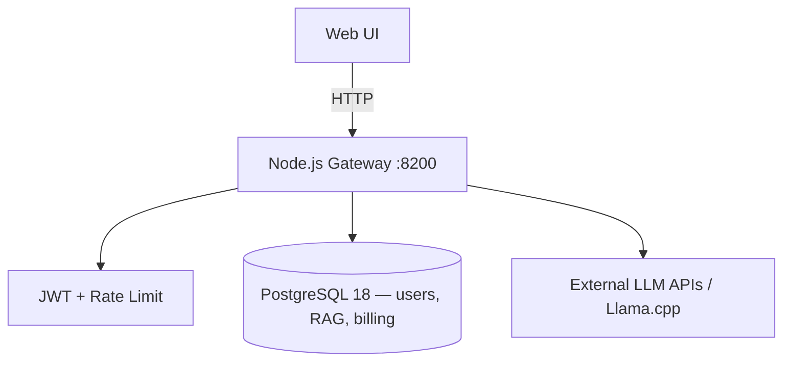

# AvgExpert Gateway — Локальный сервер ИИ

Многопользовательский API Gateway с авторизацией, RAG v2 (PostgreSQL + pgvector), USD-биллингом и админ-панелью.

---

## Ключевые особенности

* **Model Gateway:** унифицированный доступ к LLM (OpenAI, Gemini, DeepSeek, Qwen, Grok, Yandex, Llama.cpp) с fallback и учётом стоимости в USD.
* **RAG v2:** pgvector + TEI embedder; SQLite FTS — только degraded fallback.
* **USD Billing:** `balance_usd`, `credit_limit_usd`, Robokassa-пополнение в ₽ с конвертацией по курсу ЦБ РФ.

---

## Быстрый старт

1. **PostgreSQL 18** — обязателен. Задайте `DATABASE_URL` в `.env` (см. `.env.example`). Без PG `npm start` завершится с ошибкой подключения.
2. **Окружение:** скопируйте `.env.example` → `.env`; укажите `AVGEXPERT_SECRET` (≥32 символа) и `AVGEXPERT_ADMIN_PASSWORD`.
3. **Зависимости:** `install_deps.cmd` или `npm install` из корня репозитория (`npm run setup`).
4. **Запуск:** `start_windows.cmd` или `npm start` — только Node.js Gateway (Llama.cpp — отдельный Docker/сервис при необходимости).
5. **Вход:** [http://127.0.0.1:8200](http://127.0.0.1:8200) — логин `admin`, пароль из `.env`.

Основные переменные:
* `AVGEXPERT_PORT` — порт Gateway (default **8200**)
* `DATABASE_URL` — PostgreSQL для app-таблиц и RAG
* `APP_PG_ENABLED=true` — обязателен для prod/dev (false только для отладки)
* `RAG_V2_ENABLED` — включение vector RAG (staging/production)

---

## Docker prod и dev-remote

| Сценарий | Документация |
|----------|--------------|
| **Prod** (PG 18, TEI, Llama на GPU) | [`deploy/prod/README.md`](deploy/prod/README.md) |
| **Ноутбук** + сервисы на pilot (SSH-туннели) | [`deploy/dev/DEV_REMOTE.md`](deploy/dev/DEV_REMOTE.md) |

---

## Архитектура (упрощённо)



Gateway проверяет JWT, биллинг (`balance_usd + credit_limit_usd`), инжектирует промпты и проксирует к провайдерам.

---

## RAG и документы

- [`docs/architecture/RAG_MIGRATION_PLAN.md`](docs/architecture/RAG_MIGRATION_PLAN.md)
- [`docs/ops/USER_KB_SECURITY.md`](docs/ops/USER_KB_SECURITY.md)

---

## Тестирование

```cmd
npm test
```

Интеграционные тесты с PG требуют `DATABASE_URL` в окружении.

---

## Развёртывание

Prod: [`deploy/prod/README.md`](deploy/prod/README.md).  
Windows/IIS: `IIS_DEPLOYMENT_GUIDE.md`.

Данные приложения и RAG хранятся в **PostgreSQL**, не в локальных SQLite-файлах.
