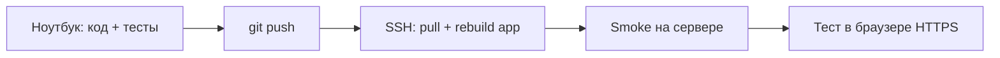

# Разработка на ноутбуке → опытная эксплуатация в интернете

Регламент для фазы **опытной эксплуатации**: код пишется локально, выкатывается на сервер с публичным URL, тестируется сразу в браузере.

---

## Схема процесса



| Среда | Где | Назначение |
|-------|-----|------------|
| **Local** | Ноутбук | Разработка, `npm test`, быстрый цикл |
| **Pilot** | Сервер L4 + Docker | Опытная эксплуатация, реальный WEB/RAG/GPU |
| *(позже)* **Prod** | Отдельный хост | Стабильный релиз для пользователей |

На этапе опытной эксплуатации **Pilot = ваш публичный сервер**. Отдельный staging не обязателен, но нужны дисциплина и чеклист.

---

## Старт работы агента

В новом чате достаточно **«продолжай»** — см. [`docs/sprints/SPRINT_STATE.md`](../../docs/sprints/SPRINT_STATE.md). План в чат не копировать.

**Первый раз на pilot:** [SSH_DEPLOY.md](SSH_DEPLOY.md) → [RAG_DB_MIGRATION.md](RAG_DB_MIGRATION.md) → этот документ.  
**Dev на ноутбуке:** [DEV_REMOTE.md](../dev/DEV_REMOTE.md) + `deploy/dev/tunnel.sh`.

## Ежедневный цикл (рекомендуется)

### 1. На ноутбуке — перед выкатом

```bash
cd avgexpert
npm run typecheck
npm run test:pr          # быстрый gate (~1–2 мин)
# при изменениях RAG:
# npm run test:rag
```

Не выкатывать без зелёных тестов, если менялись auth, chat, RAG, uploads.

### 2. Коммит и push

```bash
git add ...
git commit -m "fix: ..."
git push origin main     # или ветка pilot
```

**Не коммитить:** `.env`, `deploy/prod/.env`, `deploy/prod/.env.migrate`, API-ключи.

### 3. Выкат на сервер (2–5 мин)

С ноутбука (Git Bash / WSL):

```bash
npm run prod:ssh-update
```

Или вручную на сервере:

```bash
cd /opt/avgexpert/avgexpert
git pull
docker compose --env-file deploy/prod/.env -f deploy/prod/compose.yml up -d --build app
bash deploy/prod/scripts/post-deploy.sh
```

Пересобирается только контейнер **`app`**. TEI, Llama, PG не трогаются — быстро.

### 4. Smoke (1 мин)

```bash
npm run prod:ssh-status
# на сервере:
curl -s http://127.0.0.1:8200/health
curl -s http://127.0.0.1:8200/ready
```

### 5. Тест в интернете

- Открыть `https://ваш-домен/`
- Логин → чат с RAG → загрузка файла (если меняли KB)
- При сбое: `npm run prod:ssh-logs` или `docker compose logs -f app`

---

## Что настраивается один раз

| Файл | Где живёт | В git? |
|------|-----------|--------|
| `deploy/prod/.env` | Только сервер | **Нет** |
| `deploy/prod/providers/*.env` | Только сервер | **Нет** |
| `deploy/prod/ssh-deploy.env` | Ноутбук | **Нет** |
| `pg-data` (PG: users, sessions, RAG) | Docker volume на сервере | **Нет** |

Код и `webui_dist` (сборка в образе) — из git.

---

## Два режима выката

### Быстрый (90% случаев) — только код Gateway/UI

Изменения в `src/`, `webui_src/`, `server.ts`:

```bash
git push && npm run prod:ssh-update
```

### Полный (редко) — инфраструктура

Изменения в `deploy/prod/compose.yml`, TEI, Llama, nginx:

```bash
ssh user@сервер
cd /opt/avgexpert/avgexpert
git pull
docker compose --env-file deploy/prod/.env -f deploy/prod/compose.yml up -d --build
```

Первый раз после изменения compose — предупредить пользователей опытной эксплуатации (краткий downtime).

---

## Ветки git

| Подход | Когда |
|--------|-------|
| **`main` → сразу pilot** | Малая команда, опытная эксплуатация, быстрые итерации |
| **`develop` + `main`** | Хотите накопить изменения, выкатывать раз в день |
| **feature branches + PR** | Перед переходом в стабильный prod |

Для опытной эксплуатации достаточно **`main`** + обязательный `test:pr` локально.

---

## Режим «проверить до commit» (осторожно)

Незакоммиченный код на сервер через rsync — только для личной отладки:

```env
# deploy/prod/ssh-deploy.env
DEPLOY_MODE=rsync
LOCAL_REPO_ROOT=E:/LA/cons
```

```bash
bash deploy/prod/scripts/ssh-deploy.sh update
```

Минусы: нет истории, легко потерять синхрон с git. **Не использовать** как основной процесс.

---

## Безопасность опытной эксплуатации

- [ ] HTTPS на nginx (Let's Encrypt)
- [ ] Сильный `AVGEXPERT_ADMIN_PASSWORD`
- [ ] Ограничить доступ: VPN, basic auth на nginx, или IP whitelist — если не публичный beta
- [ ] Бэкап PG перед рискованными миграциями:
  ```bash
  docker compose exec postgres pg_dump -U avg avgexpert -Fc -f /tmp/backup.dump
  ```
- [ ] Не запускать `migrate-rag-db.sh` при каждом выкате — только при переносе/сбросе KB

---

## Откат за 1 минуту

```bash
ssh user@сервер
cd /opt/avgexpert/avgexpert
git log -3
git checkout <предыдущий-commit>
docker compose --env-file deploy/prod/.env -f deploy/prod/compose.yml up -d --build app
```

Данные PG в volume `pg-data` **сохраняются**.

---

## Чеклист одного релиза

```
[ ] npm run typecheck && npm run test:pr  (ноутбук)
[ ] git push
[ ] npm run prod:ssh-update
[ ] /health и /ready OK
[ ] smoke в браузере (логин + чат)
[ ] при изменении RAG — тест retrieval / upload
```

---

## Когда добавить отдельный staging

Переходите на **два сервера**, когда:

- на опытной эксплуатации > 5–10 активных пользователей;
- нельзя допускать downtime при выкате;
- нужен sign-off перед «настоящим» prod.

До тех пор **ноутбук + публичный pilot-сервер** — нормальная и эффективная схема.

---

## Команды-шпаргалка

| Действие | Команда |
|----------|---------|
| Тесты локально | `npm run test:pr` |
| Выкат | `npm run prod:ssh-update` |
| Статус | `npm run prod:ssh-status` |
| Логи | `npm run prod:ssh-logs` |
| GPU/VRAM | `bash deploy/prod/scripts/check-gpu.sh` (на сервере) |
