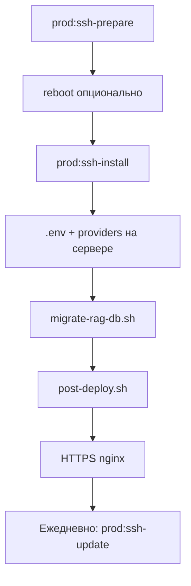

# Развёртывание по SSH (удалённый сервер)

Инструкция для выката **AvgExpert** на **Tesla L4 vGPU-8-16-L4-8Q** с вашего ПК через SSH.

## Единый сценарий pilot (D5)



| Этап | Команда (ноутбук) | Документ |
|------|-------------------|----------|
| 1. Подготовка ОС | `npm run prod:ssh-prepare` | [SERVER_PREP.md](SERVER_PREP.md) |
| 2. Первый стек Docker | `npm run prod:ssh-install` | [README.md](README.md) |
| 3. Перенос RAG KB | `npm run prod:migrate-rag` (на сервере) | [RAG_DB_MIGRATION.md](RAG_DB_MIGRATION.md) |
| 4. Dev на ноутбуке | `deploy/dev/tunnel.sh` + `npm start` | [DEV_REMOTE.md](../dev/DEV_REMOTE.md) |
| 5. Выкат кода | `npm run prod:ssh-update` | [DEV_TO_PILOT.md](DEV_TO_PILOT.md) |

---

## Что нужно заранее

### На вашем ПК (Windows)

| Что | Зачем |
|-----|--------|
| **OpenSSH Client** | `ssh`, `scp` (Windows 10+: «Параметры → Приложения → Дополнительные компоненты») |
| **Git** | клонирование на сервере или [Git Bash](https://git-scm.com/) для скриптов |
| **SSH-ключ** | вход без пароля (`ssh-keygen`, ключ в `~/.ssh/id_ed25519.pub`) |
| Доступ к репозиторию | URL git или архив проекта |

Опционально: **WSL** — удобнее для `bash deploy/prod/scripts/ssh-deploy.sh`.

### На удалённом сервере

| Параметр | Требование |
|----------|------------|
| ОС | Ubuntu 22.04 / 24.04 (рекомендуется) |
| CPU / RAM / GPU | 8 vCPU, 16 GB RAM, **8192 MB VRAM** (L4) |
| Диск | ≥ **80 GB** свободно |
| SSH | порт **22** (или свой), пользователь с **sudo** |
| Сеть | входящие **80**, **443** (WEB); исходящий HTTPS для моделей и API |
| Домен (опционально) | A-запись на IP сервера для HTTPS |

Провайдер GPU обычно уже ставит драйвер NVIDIA — проверьте после первого входа:

```bash
nvidia-smi
```

### Секреты (подготовить до деплоя)

- `AVGEXPERT_ADMIN_PASSWORD` — пароль администратора WEB
- `AVGEXPERT_SECRET` — ≥ 32 символа (JWT)
- API-ключи: OpenAI, DeepSeek, Grok и т.д.
- Домен: `PUBLIC_BASE_URL`, `AVGEXPERT_ALLOWED_ORIGINS`

Файлы с секретами **не коммитить** в git.

---

## Способ 1 — автоматический скрипт с ПК

```bash
# Из корня avgexpert/ (Git Bash / WSL / Linux)
cp deploy/prod/ssh-deploy.env.example deploy/prod/ssh-deploy.env
# SERVER, REMOTE_ROOT, GIT_REPO

npm run prod:ssh-prepare   # prepare-server.sh (locale, swap, UFW)
# reboot на сервере при необходимости

npm run prod:ssh-install   # git pull + install.sh (Docker, compose up)

npm run prod:ssh-update    # только rebuild app (ежедневный выкат)
npm run prod:ssh-status    # ps + check-gpu
npm run prod:ssh-logs      # compose logs -f
```

Эквивалент: `bash deploy/prod/scripts/ssh-deploy.sh [prepare|install|update|status|logs]`.

Скрипт:

1. Проверяет SSH-доступ
2. Копирует проект на сервер (`git pull` или `rsync`)
3. **prepare** — `prepare-server.sh`; **install** — `install.sh`; **update** — rebuild `app` + `post-deploy.sh`
4. Подсказывает следующие шаги (`.env`, migrate RAG, HTTPS)

---

## Подготовка чистой машины (обновление + русский язык)

Перед Docker выполните на сервере:

```bash
sudo bash deploy/prod/scripts/prepare-server.sh
sudo reboot
```

Подробно: **[SERVER_PREP.md](SERVER_PREP.md)** — локаль `ru_RU.UTF-8`, часовой пояс, swap, firewall.

---

## Способ 2 — вручную по SSH

### Шаг 1. Подключение

```powershell
# Windows PowerShell
ssh user@IP_СЕРВЕРА
```

Скопировать SSH-ключ (один раз):

```powershell
type $env:USERPROFILE\.ssh\id_ed25519.pub | ssh user@IP_СЕРВЕРА "mkdir -p ~/.ssh && cat >> ~/.ssh/authorized_keys"
```

### Шаг 2. Клонирование на сервере

```bash
sudo mkdir -p /opt/avgexpert
sudo chown $USER:$USER /opt/avgexpert
git clone <URL-репозитория> /opt/avgexpert
cd /opt/avgexpert/avgexpert
```

### Шаг 3. Подготовка ОС (чистый сервер)

```bash
sudo bash deploy/prod/scripts/prepare-server.sh
sudo reboot
```

### Шаг 4. Установка стека

```bash
sudo bash deploy/prod/install.sh
```

Первый запуск: **30–90 мин** (скачивание моделей TEI + Qwen).

Мониторинг:

```bash
docker compose --env-file deploy/prod/.env -f deploy/prod/compose.yml logs -f tei-bge-m3 llama-cpp
```

### Шаг 4. Настройка `.env`

```bash
nano deploy/prod/.env
```

Обязательно:

```env
AVGEXPERT_ADMIN_PASSWORD=ваш-сильный-пароль
PUBLIC_DOMAIN=ai.example.com
PUBLIC_BASE_URL=https://ai.example.com
AVGEXPERT_ALLOWED_ORIGINS=https://ai.example.com
```

Провайдеры:

```bash
cp deploy/prod/providers/openai_gpt4_1.env.example deploy/prod/providers/openai_gpt4_1.env
nano deploy/prod/providers/openai_gpt4_1.env
```

Перезапуск:

```bash
docker compose --env-file deploy/prod/.env -f deploy/prod/compose.yml up -d
```

### Шаг 5. Перенос RAG-базы с удалённого сервера

Если данные на `83.166.253.250` (или другом PG):

```bash
cp deploy/prod/.env.migrate.example deploy/prod/.env.migrate
nano deploy/prod/.env.migrate   # SOURCE_DATABASE_URL
bash deploy/prod/scripts/migrate-rag-db.sh --dry-run
bash deploy/prod/scripts/migrate-rag-db.sh
```

Подробно: **[RAG_DB_MIGRATION.md](RAG_DB_MIGRATION.md)**

### Шаг 6. Миграции и проверка

```bash
bash deploy/prod/scripts/post-deploy.sh
bash deploy/prod/scripts/check-gpu.sh
curl -s http://127.0.0.1:8200/health
```

### Шаг 6. WEB снаружи

- HTTP: `http://IP_СЕРВЕРА/` (nginx, порт 80)
- HTTPS: см. [README.md](README.md) § Let's Encrypt

---

## Обновление версии по SSH

На сервере:

```bash
cd /opt/avgexpert/avgexpert
git pull
docker compose --env-file deploy/prod/.env -f deploy/prod/compose.yml up -d --build app
bash deploy/prod/scripts/post-deploy.sh
```

С локального ПК (если настроен `ssh-deploy.env`):

```bash
npm run prod:ssh-update
```

---

## Типичные проблемы

| Симптом | Решение |
|---------|---------|
| `Permission denied (publickey)` | Добавьте SSH-ключ на сервер |
| `nvidia-smi` не работает | Драйвер GPU / перезагрузка ВМ у провайдера |
| CUDA OOM | `deploy/prod/presets/8gb-vram.env`, `npm run prod:check-gpu` |
| Порт 80 закрыт | Security group / firewall провайдера |
| Долгая загрузка | Норма для первого старта; смотрите `logs -f tei-bge-m3` |

---

## Минимальный чеклист

- [ ] SSH + sudo на сервере
- [ ] `nvidia-smi` показывает L4, ~8192 MiB
- [ ] ≥ 80 GB диска, swap 8 GB
- [ ] Проект в `/opt/avgexpert/avgexpert`
- [ ] `deploy/prod/.env` с паролем и доменом
- [ ] `providers/*.env` с API-ключами
- [ ] `install.sh` + `post-deploy.sh` без ошибок
- [ ] `curl /health` → `vector` ok
- [ ] Браузер: логин `admin`
