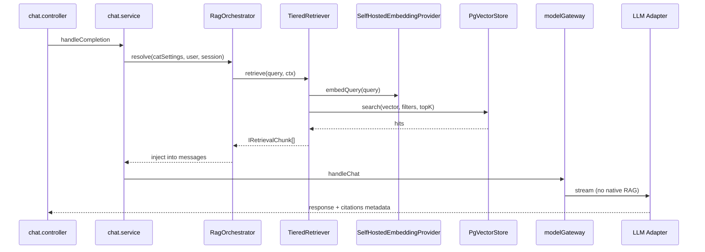

# Архитектурный концепт и план миграции RAG

**Проект:** AvgExpert  
**Версия документа:** 1.3  
**Дата:** 2026-06-09  
**Статус:** Approved → Implementation (единый источник правды; архитектурные решения — §11)  

---

## 1. Резюме для руководства

### 1.1 Цель

Перейти от фрагментированного RAG (SQLite FTS, embed+search внутри `yandex_file_search`, планируемые облачные collections) к **единой decoupled-архитектуре**:

- **Один** pipeline индексации и поиска (VectorKB)
- **Один** self-hosted embedding-провайдер на namespace *(кандидат: bge-m3 / multilingual-e5 — фиксация после recall@k, см. §11.1)*
- **Любой** LLM-адаптер для генерации (Yandex, OpenAI, Grok — равноправно)
- **Три** уровня качества (Консультант / Эксперт / Мудрец) через политику retrieval, не через разные хранилища

### 1.2 Ключевые принципы


| #   | Принцип                | Формулировка                                                                    |
| --- | ---------------------- | ------------------------------------------------------------------------------- |
| P1  | Separation of concerns | Embed + Store + Retrieve ≠ LLM Generate                                         |
| P2  | Provider parity        | Yandex — такой же adapter, как OpenAI/Grok; без отдельного RAG-класса           |
| P3  | Single source of truth | pgvector `kb_`* — единственный production-индекс для RAG                        |
| P4  | Tier ≠ Provider        | Категория задаёт глубину поиска; provider задаёт модель ответа                  |
| P5  | Pluggable ports        | `EmbeddingProvider`, `VectorStore`, `Retriever` — сменяемые без правок chat/LLM |
| P6  | Scope isolation        | global / user / session — фильтры в VectorStore, не отдельные облака            |


### 1.3 Ожидаемый результат

- Предсказуемое качество RAG на русском (единый embedder, богатые метаданные чанков)
- Снижение vendor lock-in (LLM и vector backend сменяемы)
- Единый UX: постоянная база (настройки) + временная (чат) на одной схеме
- Упрощение адаптеров: только LLM + optional response cache

---

## 2. Текущее состояние (AS-IS)

```
┌─────────────────────────────────────────────────────────────────┐
│ chat.service                                                     │
│   if rag_enabled → KnowledgeGateway (SQLite FTS) → inject       │
│   → modelGateway → adapter                                       │
└─────────────────────────────────────────────────────────────────┘

Параллельно (обход gateway):
  yandex_file_search: Yandex embed → avg_vector_chunks (PG) → inject → Alice
  grok / openai: native file_search (env) — не унифицировано
```


| Компонент                       | Проблема                                                  |
| ------------------------------- | --------------------------------------------------------- |
| `KnowledgeGateway` + SQLite FTS | Нет векторного поиска; не user/session scope              |
| `yandex_file_search`            | Дублирует RAG; привязка embed к Yandex 256d               |
| `grok.env` GROK_COLLECTION_IDS  | Облачный индекс, не согласован с PG                       |
| `categories`                    | `rag_enabled` без `retrieval_tier`; provider смешан с RAG |
| Ingestion                       | Только `.txt/.md` в SQLite, без embed                     |


---

## 3. Целевая архитектура (TO-BE)

### 3.1 Слои системы

```
┌──────────────────────────────────────────────────────────────────────────┐
│ L7  UI / API          upload settings, attach chat, category select       │
├──────────────────────────────────────────────────────────────────────────┤
│ L6  chat.service      RagOrchestrator → inject context → modelGateway      │
├──────────────────────────────────────────────────────────────────────────┤
│ L5  Retriever         TieredRetriever (consultant | expert | sage)         │
├──────────────────────────────────────────────────────────────────────────┤
│ L4  Ports             EmbeddingProvider  │  VectorStore                   │
├──────────────────────────────────────────────────────────────────────────┤
│ L3  Storage           PostgreSQL pgvector (kb_chunks, kb_semantic_*)       │
├──────────────────────────────────────────────────────────────────────────┤
│ L2  Ingestion         Chunker → Embed batch → upsert; GC session scope     │
├──────────────────────────────────────────────────────────────────────────┤
│ L1  LLM Adapters      yandex | openai_gpt4_1 | openai_gpt5_5 | grok       │
│                       (LLM only, no embed/search)                          │
└──────────────────────────────────────────────────────────────────────────┘
```

### 3.2 Контракты (ports)

#### EmbeddingProvider

```typescript
interface EmbeddingProvider {
  readonly id: string;           // 'bge-m3'
  readonly dimensions: number;   // 1024 (фиксируется S0-6)
  readonly model: string;        // 'BAAI/bge-m3'
  embed(texts: string[]): Promise<number[][]>;
  embedQuery(text: string): Promise<number[]>;
}
```

#### VectorStore

```typescript
interface VectorStore {
  readonly id: string;           // 'pgvector'
  upsert(chunks: VectorChunk[]): Promise<void>;
  search(params: VectorSearchParams): Promise<VectorHit[]>;
  delete(filter: VectorFilter): Promise<number>;
  health(): Promise<boolean>;
}

interface VectorChunk {
  id: string;
  namespace: string;             // 'bge-m3-v1'
  scope: 'global' | 'user' | 'session';
  ownerUserId?: string;
  sessionId?: string;
  body: string;
  title?: string;
  embedding: number[];
  // индексные поля — см. §3.4
  metadata: Record<string, unknown>;
}
```

#### Retriever

```typescript
interface Retriever {
  retrieve(query: string, ctx: RetrievalContext): Promise<IRetrievalChunk[]>;
}

interface RetrievalContext {
  userId: string;
  sessionId?: string;
  tier: 'consultant' | 'expert' | 'sage';
  scopes: ('global' | 'user' | 'session')[];
  globalKbEnabled: boolean;
}
```

### 3.3 Поток запроса




### 3.4 Схема данных PostgreSQL

#### `kb_chunks`


| Поле                   | Тип         | Назначение                                 |
| ---------------------- | ----------- | ------------------------------------------ |
| id                     | UUID PK     |                                            |
| namespace              | TEXT        | семейство векторов (provider+model+dims)   |
| scope                  | TEXT        | global | user | session                    |
| owner_user_id          | TEXT        | для user/session                           |
| session_id             | TEXT        | для session                                |
| doc_id                 | UUID        | группировка чанков документа               |
| body                   | TEXT        | текст чанка                                |
| title                  | TEXT        |                                            |
| section_path           | TEXT        | иерархия в документе                       |
| page_from, page_to     | INT         |                                            |
| doc_type               | TEXT        | `canonical_book`, policy, contract, faq, … |
| book_id                | UUID        | для канонических книг                      |
| book_title             | TEXT        | полное название книги                      |
| chapter_index          | INT         | номер главы                                |
| chapter_title          | TEXT        | название главы                             |
| section_index          | INT         | номер подраздела                           |
| section_title          | TEXT        | название подраздела                        |
| domain_tags            | TEXT[]      | предметная область                         |
| entity_ids             | UUID[]      | связь с графом                             |
| chunk_index            | INT         | порядок в документе                        |
| token_count            | INT         |                                            |
| embedding              | vector(N)   | HNSW index; N = dims из S0-6               |
| checksum               | TEXT        | дедуп                                      |
| created_at, indexed_at | TIMESTAMPTZ |                                            |


#### `kb_documents` (метаданные загрузки)


| Поле                                 | Назначение                            |
| ------------------------------------ | ------------------------------------- |
| id, scope, owner_user_id, session_id |                                       |
| filename, mime, size, status         | pending | processing | ready | failed |
| source_uri                           |                                       |


#### `kb_semantic_nodes` / `kb_semantic_edges` (фаза 2–3)

Связь с существующими `domain_boundaries`, `claims` (SQLite v009).

#### `llm_response_cache` (унификация)

Обобщение `yandex_llm_cache` для всех adapters: `cache_key`, `provider_id`, `response_text`, `usage`.

### 3.5 Четыре уровня контекста


| Уровень         | Источник               | VectorKB scope | Управление                           |
| --------------- | ---------------------- | -------------- | ------------------------------------ |
| L1 Conversation | `messages[]`           | —              | truncate (S3-7); summarize — post-v1 |
| L2 Global KB    | admin corpus           | `global`       | `global_kb_enabled` в категории      |
| L3 User KB      | настройки пользователя | `user`         | persistent до удаления               |
| L4 Session KB   | attach в чате          | `session`      | GC при удалении сессии               |


### 3.6 Три категории (tier policy)

**Продуктовая модель (роли, не scope-ограничения):**


| Роль            | Назначение                                                           |
| --------------- | -------------------------------------------------------------------- |
| **Консультант** | Большой корпус книг и материалов; подготовка материалов для Эксперта |
| **Эксперт**     | Аналитические отчёты и исследования по материалам Консультанта       |
| **Мудрец**      | Создание нового на основе аналитических исследований Эксперта        |


Пользователь **свободно переключает** категорию в любой момент. KB scopes (`global` / `user` / `session`) **одинаковы для всех tier**; различие — только глубина retrieval (topK) и post-score.


| Tier           | topK | Post-score boost                              | Semantic graph             | Примеры LLM                                            |
| -------------- | ---- | --------------------------------------------- | -------------------------- | ------------------------------------------------------ |
| **consultant** | 3    | нет                                           | нет                        | Alice Flash, gpt-4.1-mini, grok-4.1-fast-non-reasoning |
| **expert**     | 7    | metadata-weighted *(не cross-encoder rerank)* | same-domain tags           | gpt-4.1, grok-4.1-fast-reasoning, Alice LLM            |
| **sage**       | 12   | metadata-weighted + recency                   | multi-hop *(R&D, post-v1)* | gpt-5.5, grok-4.3, Alice LLM                           |


Embedding **одинаковый** на всех tier: self-hosted (кандидат bge-m3 / multilingual-e5; dims фиксируются в S0-6).

### 3.7 Конфигурация

#### Глобальный `.env` (deployment)

```env
EMBEDDING_PROVIDER=self-hosted          # bge-m3 | multilingual-e5
EMBEDDING_MODEL=bge-m3                  # фиксируется после S0-6
EMBEDDING_DIMS=1024                     # зависит от модели
EMBEDDING_NAMESPACE=bge-m3-v1           # фиксируется после S0-6
EMBEDDING_ONNX_PATH=/models/bge-m3.onnx # или HF/transformers endpoint
VECTOR_STORE=pgvector
DATABASE_URL=postgresql://...
```

#### Категория (SQLite `categories`)

```json
{
  "name": "Консультант",
  "provider": "yandex",
  "model_name": "aliceai-llm-flash/latest",
  "rag_enabled": true,
  "retrieval_tier": "consultant",
  "extra_params": {}
}
```

### 3.8 Судьба существующих компонентов


| Компонент                     | Действие                                                                                                                                                                                                                            |
| ----------------------------- | ----------------------------------------------------------------------------------------------------------------------------------------------------------------------------------------------------------------------------------- |
| `yandex_file_search.js`       | Deprecate: embed+search удалить; LLM-only path → `**yandex.js**` (chat-completions / Responses)                                                                                                                                     |
| `yandex.js`                   | Каноничный Yandex LLM adapter (inject-only при RAG_V2)                                                                                                                                                                              |
| `KnowledgeGateway` SQLite FTS | Fallback retriever `fts`; primary → `vector`                                                                                                                                                                                        |
| `avg_vector_chunks`           | **Re-indexing канонического корпуса**, не ETL векторов: export `body`/metadata → `IngestionPipeline` → self-hosted embed → `kb_chunks` с иерархическими метаданными книг (§11.4). Поле `embedding` (Yandex 256d) **не переносится** |
| `grok` GROK_COLLECTION_IDS    | Убрать из RAG path; optional mirror off                                                                                                                                                                                             |
| `compare_embeddings.js`       | Pairwise/margin QA; **не** gate для выбора embedder (см. S0-6 recall@k)                                                                                                                                                             |
| `compare_rag_models.js`       | Обновить: единый inject + разные LLM                                                                                                                                                                                                |
| `knowledge.cache.ts`          | Ключ только по query — **ломает isolation**; заменить в S3-6 (см. §11.5)                                                                                                                                                            |


---

## 4. Нефункциональные требования


| ID    | Требование                     | Метрика                                                                                              |
| ----- | ------------------------------ | ---------------------------------------------------------------------------------------------------- |
| NFR-1 | Latency retrieval (consultant) | p95 < 300 ms (excl. LLM) при self-hosted embedder (§11.1)                                            |
| NFR-2 | Indexing feedback              | UI status < 3 s после upload (ack); полная индексация — async                                        |
| NFR-3 | Session GC                     | chunk cleanup < 1 min после delete session                                                           |
| NFR-4 | Isolation                      | user A не видит chunks user B (SQL + cache key + tests)                                              |
| NFR-5 | Observability                  | trace: embed_ms, search_ms, tier, chunk_count, cache_hit                                             |
| NFR-6 | RAG accuracy (consultant)      | recall@3 ≥ baseline на доменном eval-наборе (≥ 30 запросов); keyword-match — вспомогательная метрика |


---

## 5. Риски и митигация


| Риск                                | Вероятность | Митигация                                                                     |
| ----------------------------------- | ----------- | ----------------------------------------------------------------------------- |
| Качество chunking                   | Высокая     | Итерации chunker; поля section_path, doc_type                                 |
| Re-index при смене embed            | Средняя     | namespace versioning; blue/green index; бюджет re-embed (Cost §5.1)           |
| Регрессия Yandex prod               | Средняя     | Feature flag `RAG_V2_ENABLED`; A/B по категории; rollback plan (§5.2)         |
| PG нагрузка                         | Средняя     | HNSW, connection pool, topK лимиты; S1-6: проверка pgvector ≥ 0.5 на prod PG  |
| Длительная индексация PDF           | Высокая     | Async worker + статус в UI                                                    |
| **Data egress / приватность (C3)**  | Снят        | Self-hosted embedder для всех scope (§11.1); данные не покидают периметр      |
| **NFR-1 vs облачный embedder (H1)** | Снят        | Self-hosted embedder (§11.1)                                                  |
| **Неверный выбор embedder (H2)**    | Средняя     | S0-6: recall@k на реальном корпусе до фиксации namespace                      |
| **Cache isolation leak (C2)**       | Высокая     | S3-6: ключ `hash(query + namespace + tier + scopes + userId + sessionId)`     |
| **«Rerank» overpromise (H3)**       | Средняя     | MVP: metadata-weighted scoring (S7); cross-encoder bge-reranker — S7b (§11.2) |
| **Семантический граф (H4)**         | Высокая     | S8 = R&D spike, не production gate для v1                                     |
| **Слабый eval (M5)**                | Средняя     | Доменный RU eval-набор + recall/faithfulness; не только keyword ≥ 0.5         |
| **Деградация embedder/PG (M6)**     | Средняя     | S4-6: degraded mode → SQLite FTS fallback; health-gated retriever switch      |


### 5.1 Модель затрат (ориентир)


| Статья                          | Формула / оценка                  | Примечание                                                                  |
| ------------------------------- | --------------------------------- | --------------------------------------------------------------------------- |
| Индексация (one-time migration) | `chunks × price_per_1k_tokens`    | Re-embed всего `avg_vector_chunks` + global corpus; **не** перенос векторов |
| Индексация (ongoing)            | upload_tokens × embed_price       | User/session uploads                                                        |
| Query retrieval                 | `queries × embed_price` + PG cost | Cache hit → embed_price = 0                                                 |
| A/B переходный период           | ~2× embed при dual-write контента | Осознанная стоимость; не dual-write векторов                                |
| LLM generation                  | tier × provider pricing           | Вне scope VectorKB; учитывать в категориях «по цене»                        |
| Self-hosted embedder            | GPU/CPU amortization              | Основной путь (§11.1); без per-token API cost                               |


*Точные тарифы LLM-провайдеров — см. `docs/99_Concept/Prices per 1M tokens..md`.*

### 5.2 Rollback при A/B

1. `RAG_V2_ENABLED=false` → мгновенный откат retriever path на legacy (FTS / yandex_file_search).
2. Данные: `kb_chunks` остаётся; `avg_vector_chunks` read-only до полного cutover (S10).
3. Dual-write контента в переходный период — опционально; при rollback новые `kb_chunks` не используются, legacy индекс не затронут.
4. Re-embed стоимость при повторном включении v2 — невозвратная; не удалять namespace до retro.

---

## 5.3 Не входит в scope (non-goals)

- Нативный RAG внутри LLM API (file_search, Grok collections) как primary path
- Автоматическое построение production-ready семантического графа (S8 — только spike)
- Cross-encoder rerank в MVP tier expert/sage
- Мультимодальный embed (изображения в чанках)
- Federated search по внешним API (Confluence, SharePoint) без отдельного ADR
- Замена PostgreSQL на dedicated vector DB (Qdrant, Weaviate)

---

## 6. План миграции

### Обзор этапов

```
Этап 0: Подготовка          (Спринт 0)
Этап 1: Vector Foundation   (Спринты 1–2)
Этап 2: RAG Integration     (Спринты 3–4)
Этап 3: User/Session KB     (Спринты 5–6)
Этап 4: Tiers + Semantic    (Спринты 7–8)
Этап 5: Deprecation + Hardening (Спринты 9–10)
```

**Длительность:** ~~10 спринтов × 2 недели = **~~5 месяцев** (команда 1–2 dev).  
Спринты можно сжать при параллельной работе backend + frontend.

---

### Этап 0 — Подготовка

**Цель:** зафиксировать контракты, флаги, eval baseline.

#### Спринт 0 (2 недели)


| ID   | Задача                                                         | DoD                                                                       |
| ---- | -------------------------------------------------------------- | ------------------------------------------------------------------------- |
| S0-1 | Зафиксировать архитектурные решения §11 в этом документе       | Решения §11.1–§11.6 отмечены Approved                                     |
| S0-2 | Расширить `compare_rag_models.js`: режим inject-only           | Baseline JSON для 3 tier LLM                                              |
| S0-3 | Feature flag `RAG_V2_ENABLED` в config                         | env + config.ts                                                           |
| S0-4 | Миграция categories: `retrieval_tier`, `rag_enabled` schema    | SQLite migration v026                                                     |
| S0-5 | Карта категорий → provider + tier + model                      | Таблица §7                                                                |
| S0-6 | **Recall@k eval** на реальном корпусе (≥30 запросов, ≥50 docs) | Отчёт: self-hosted vs Yandex baseline; gate до фиксации namespace (§11.3) |
| S0-7 | Доменный RU eval-набор (замена keyword-only `rag.eval.js`)     | ≥30 размеченных query→chunk pairs                                         |


**Критерий выхода:** решения §11 зафиксированы, recall@k gate пройден, baseline метрик, флаг, схема categories.

---

### Этап 1 — Vector Foundation

**Цель:** ports + PG schema + self-hosted embedder.

#### Спринт 1 (2 недели)


| ID   | Задача                                                                          | DoD                                        |
| ---- | ------------------------------------------------------------------------------- | ------------------------------------------ |
| S1-1 | Модуль `src/modules/vector/` структура                                          | ports, types, registry                     |
| S1-2 | `SelfHostedEmbeddingProvider` (ONNX / transformers; bge-m3 или multilingual-e5) | unit tests + mock                          |
| S1-3 | PG migration: `kb_documents`, `kb_chunks`                                       | HNSW index (dims по S0-6)                  |
| S1-4 | `PgVectorStore.upsert/search/delete`                                            | integration test с testcontainers/local PG |
| S1-5 | `EmbeddingService` factory из env                                               | configLoader расширение                    |
| S1-6 | Проверка prod PG: `pgvector` extension, версия ≥ 0.5, HNSW на `83.166.253.250`  | checklist + migration smoke                |


#### Спринт 2 (2 недели)


| ID   | Задача                                                                                                                                                                                        | DoD                                                                           |
| ---- | --------------------------------------------------------------------------------------------------------------------------------------------------------------------------------------------- | ----------------------------------------------------------------------------- |
| S2-1 | `ChunkingService` (size, overlap, section-aware stub)                                                                                                                                         | md/txt ingest                                                                 |
| S2-2 | `IngestionPipeline`: file → chunks → embed → upsert                                                                                                                                           | CLI `npm run kb:ingest`                                                       |
| S2-3 | Admin API: ingest global document (scope=global)                                                                                                                                              | POST /admin/kb/documents                                                      |
| S2-4 | Health check: vector store + embedder                                                                                                                                                         | /health vector section                                                        |
| S2-5 | **Re-indexing канонического корпуса**: export текстов книг → section-aware chunking → обогащение метаданными (§11.4) → self-hosted embed → `kb_chunks`. Векторы Yandex 256d **не копировать** | script + validation report (chunk count, metadata completeness, recall smoke) |


**Критерий выхода:** global docs в PG, search по query вручную работает; legacy re-embedded.

---

### Этап 2 — RAG Integration

**Цель:** Retriever в chat path; LLM без native RAG.

#### Спринт 3 (2 недели)


| ID   | Задача                                                                                                                               | DoD                                            |
| ---- | ------------------------------------------------------------------------------------------------------------------------------------ | ---------------------------------------------- |
| S3-1 | `TieredRetriever` (tier=consultant only)                                                                                             | topK=3, scopes filter                          |
| S3-2 | `RagOrchestrator.resolve()`                                                                                                          | skip native RAG adapters                       |
| S3-3 | `chat.service`: if RAG_V2 → Retriever → inject                                                                                       | feature flag                                   |
| S3-4 | Унифицировать `formatContext()`                                                                                                      | совместимость `_retrieval` в response          |
| S3-5 | Trace events: `rag.embed_ms`, `rag.search_ms`, `rag.cache_hit`                                                                       | traceBus                                       |
| S3-6 | **Scoped retrieval cache**: ключ `hash(query + namespace + tier + scopes + userId + sessionId)`; замена `knowledge.cache.ts` pattern | unit test: user A ≠ user B на одинаковый query |
| S3-7 | L1 conversation context: truncate policy для длинных `messages[]`                                                                    | config max_tokens; stub summarize hook         |


#### По умолчанию consultant ищет только user/session scopes; global KB выключен(2 недели)


| ID   | Задача                                                                                  | DoD                                                                  |
| ---- | --------------------------------------------------------------------------------------- | -------------------------------------------------------------------- |
| S4-1 | Refactor `**yandex.js`** (каноничный LLM adapter): Responses + inject-only path         | без PG/embed в adapter; `yandex_file_search.js` — только deprecation |
| S4-2 | Deprecation banner на `yandex_file_search.js`                                           | log warning                                                          |
| S4-3 | Категория «Консультант»: 3 provider configs (Yandex/OpenAI/Grok)                        | admin setup                                                          |
| S4-4 | Eval: consultant tier recall@3 ≥ baseline (S0-7 набор)                                  | `eval:rag` updated                                                   |
| S4-5 | `llm_response_cache` unified table                                                      | yandex cache ported                                                  |
| S4-6 | **Degraded retriever**: при fail embedder/PG → SQLite FTS fallback; health-gated switch | integration test                                                     |


**Критерий выхода:** Консультант на RAG_V2 в staging; все 3 LLM с одним VectorKB; degraded path проверен.

---

### Этап 3 — User / Session KB

**Цель:** две пользовательские базы документов.

#### Спринт 5 (2 недели)


| ID   | Задача                                                                          | DoD                            |
| ---- | ------------------------------------------------------------------------------- | ------------------------------ |
| S5-1 | API: `POST /user/documents` upload (scope=user)                                 | auth + limits                  |
| S5-2 | API: list/delete user documents                                                 |                                |
| S5-3 | `DocumentContextResolver`: scopes user+session                                  | unit tests                     |
| S5-4 | Retriever: фильтр owner_user_id                                                 | isolation test                 |
| S5-5 | UI settings: «Мои документы»                                                    | upload + status                |
| S5-6 | **Upload validation**: size, mime whitelist, filename sanitization              | unit tests                     |
| S5-7 | **Security**: SSRF guard на source_uri; PDF/malware policy (reject или sandbox) | checklist                      |
| S5-8 | **Tenant isolation tests**: user A/B + session boundary E2E                     | automated; не откладывать в S9 |


#### Спринт 6 (2 недели)


| ID   | Задача                                                     | DoD                   |
| ---- | ---------------------------------------------------------- | --------------------- |
| S6-1 | API: `POST /chat/sessions/:id/attachments` (scope=session) |                       |
| S6-2 | Session GC worker: on delete session → delete chunks       | hook в sessions repo  |
| S6-3 | UI chat: attach + «индексируется…»                         | polling status        |
| S6-4 | Async indexing queue (in-process или temporal)             | retry + failed status |
| S6-5 | E2E test: upload → ask → delete session → chunks gone      |                       |


**Критерий выхода:** user + session docs работают на всех consultant providers.

---

### Этап 4 — Tiers + Semantic Layer

**Цель:** Эксперт и Мудрец; предметная сеть.

#### Спринт 7 (2 недели)


| ID   | Задача                                                                                                    | DoD             |
| ---- | --------------------------------------------------------------------------------------------------------- | --------------- |
| S7-1 | Retriever expert: topK=7, **metadata-weighted scoring** (doc_type, domain_tags — не cross-encoder rerank) |                 |
| S7-2 | Retriever sage: topK=12 + metadata-weighted + recency boost                                               |                 |
| S7-3 | Категории Эксперт / Мудрец в admin                                                                        | tier + models   |
| S7-4 | `global_kb_enabled` per category                                                                          | L2 toggle       |
| S7-5 | Eval suite расширен до 18+ тестов                                                                         | per-tier report |


#### Спринт 7b (1–2 недели, follow-up)


| ID    | Задача                                                | DoD              |
| ----- | ----------------------------------------------------- | ---------------- |
| S7b-1 | Self-hosted `bge-reranker-v2-m3` для expert/sage      | integration test |
| S7b-2 | Eval expert tier: сравнение metadata-only vs reranker | per-tier report  |
| S7b-3 | Latency budget: rerank ≤ 150 ms p95                   | trace report     |


#### Спринт 8 (2 недели) — **R&D spike, не production gate**


| ID   | Задача                                                     | DoD                              |
| ---- | ---------------------------------------------------------- | -------------------------------- |
| S8-1 | PG: `kb_semantic_nodes`, `kb_semantic_edges` (schema only) | migration                        |
| S8-2 | Spike: entity extraction pipeline на 10 docs               | quality report; не блокирует v1  |
| S8-3 | Spike: `SemanticGraphService.expand(hits, 1-hop)`          | prototype; sage opt-in flag      |
| S8-4 | Expert: domain_tags filter                                 | production (перенесено из графа) |
| S8-5 | Go/no-go semantic graph для v2                             | decision doc (дополнение §11.6)  |


**Критерий выхода:** 3 tier с разной глубиной на staging; sage v1 = topK=12 без обязательного графа.

---

### Этап 5 — Deprecation + Hardening

**Цель:** prod cutover, cleanup.

#### Спринт 9 (2 недели)


| ID   | Задача                                                               | DoD                                            |
| ---- | -------------------------------------------------------------------- | ---------------------------------------------- |
| S9-1 | Remove embed/search from `yandex_file_search.js` или удалить adapter |                                                |
| S9-2 | `RAG_V2_ENABLED=true` default staging                                |                                                |
| S9-3 | Load test: concurrent retrieval                                      | p95 report vs NFR-1 (с учётом embedder choice) |
| S9-4 | Security review: повторная проверка isolation + upload (регрессия)   | checklist                                      |
| S9-5 | Runbook: re-index, namespace migration, rollback                     | ops doc                                        |


#### Спринт 10 (2 недели)


| ID    | Задача                                                  | DoD           |
| ----- | ------------------------------------------------------- | ------------- |
| S10-1 | Prod cutover + rollback plan                            |               |
| S10-2 | SQLite FTS → fallback only (optional off)               |               |
| S10-3 | Remove GROK_COLLECTION_IDS from RAG path                |               |
| S10-4 | Dashboard: semantic_quality, rag latency                | admin metrics |
| S10-5 | Post-migration retro + обновление §11 при необходимости |               |


**Критерий выхода:** prod на RAG v2; legacy path отключён.

---

## 7. Матрица категорий (целевая)


| Категория   | retrieval_tier | Provider (пример) | model_name                  | global_kb | user_kb | session_kb |
| ----------- | -------------- | ----------------- | --------------------------- | --------- | ------- | ---------- |
| Консультант | consultant     | yandex            | aliceai-llm-flash/latest    | on        | on      | on         |
| Консультант | consultant     | openai_gpt4_1     | gpt-4.1-mini                | on        | on      | on         |
| Консультант | consultant     | grok              | grok-4-1-fast-non-reasoning | on        | on      | on         |
| Эксперт     | expert         | openai_gpt4_1     | gpt-4.1                     | on        | on      | on         |
| Эксперт     | expert         | grok              | grok-4-1-fast-reasoning     | on        | on      | on         |
| Мудрец      | sage           | openai_gpt5_5     | gpt-5.5                     | on        | on      | on         |
| Мудрец      | sage           | grok              | grok-4.3                    | on        | on      | on         |


*Scopes одинаковы для всех tier; отличие — topK и глубина анализа. Явное отключение scope — только через `extra_params` (опционально).*

*Одна категория в UI = один tier; выбор provider — через allowed_providers или подкатегории.*

---

## 8. Структура кода (целевая)

```
src/modules/
  vector/
    ports/
      embedding.provider.ts
      vector.store.ts
      retriever.ts
    providers/
      selfhosted.embedding.ts   # ONNX / transformers (bge-m3, multilingual-e5)
    stores/
      pgvector.store.ts
    retrievers/
      tiered.retriever.ts
    registry.ts
    types.ts
  rag/
    rag.orchestrator.ts
    document-context.resolver.ts
    format-context.ts          # из knowledge.gateway
  knowledge/                   # legacy + fallback
    adapters/sqlite_fts.adapter.ts
  ingestion/
    chunking.service.ts
    pipeline.ts
  kb/
    kb.routes.ts               # user/session/admin API
    kb.repository.ts
    session-gc.worker.ts
  providers/adapters/
    yandex.js                  # LLM only
    openai_gpt4_1.ts
    openai_gpt5_5.js
    grok.js
```

---

## 9. Definition of Done (проект)

- [ ] Все категории используют `TieredRetriever` при `rag_enabled`
- [ ] Ни один LLM adapter не вызывает embed/search
- [ ] User + session documents с GC
- [ ] 3 tier с измеримой разницей latency/quality
- [ ] Eval recall@3 ≥ baseline consultant, ≥ 90% expert на доменном RU наборе (S0-7)
- [ ] `yandex_file_search` deprecated
- [ ] Документация ops: ingest, re-index, rollback

---

## 10. Приложения

### A. Glossary


| Термин         | Определение                                                          |
| -------------- | -------------------------------------------------------------------- |
| VectorKB       | Локальный pgvector индекс `kb_chunks` + self-hosted embedder (§11.1) |
| Tier           | Политика глубины retrieval (consultant/expert/sage)                  |
| Namespace      | Версия семейства embeddings для изоляции индексов                    |
| Inject         | Подстановка retrieved context в user message                         |
| Native RAG     | file_search / collections_search внутри LLM API                      |
| Canonical book | Авторский документ с иерархией book → chapter → section (§11.4)      |


### B. Связанные документы

- `docs/sprints/SPRINT_STATE.md` — прогресс и журнал (агент обновляет; план задач — только §6 здесь)
- `scratch/compare_embeddings.js` — pairwise/margin бенчмарк (не recall gate; см. §11.3)
- `scratch/compare_rag_models.js` — eval LLM при inject
- `src/modules/knowledge/knowledge.gateway.ts` — legacy gateway (fallback)
- `src/modules/providers/adapters/yandex_file_search.js` — to deprecate

### C. Архив (историческая справка, AS-IS)

- `docs/02_architecture/ARCHITECTURE_OVERVIEW_V2_3.md` — v2.3 FTS-архитектура (до RAG v2)
- `docs/04_specs/KNOWLEDGE_GATEWAY_DESIGN.md` — SQLite FTS gateway (legacy)
- `docs/04_specs/SPEC-014-KNOWLEDGE_GATEWAY.md` — modes/orchestration (legacy)
- `docs/04_specs/SPEC-015-RETRIEVAL_CONTRACT.md` — citation contract (частично актуален для fallback)

---

## 11. Утверждённые архитектурные решения

*Дата согласования: 2026-06-09. Единственный источник правды по спорным пунктам миграции.*

### 11.1 Embedding-провайдер и приватность (C3, H1)

**Статус:** Approved (S0-1, 2026-06-09)

**Решение:** ☑ **Вариант C** — полностью self-hosted embedder для всех scope (global, user, session).


| Аспект                | Self-hosted (ONNX / bge-m3 / multilingual-e5)        |
| --------------------- | ---------------------------------------------------- |
| Где выполняется embed | On-prem / в VPC рядом с PG                           |
| Data egress           | Нет — приватные документы L3/L4 не покидают периметр |
| Latency query-embed   | 20–80 ms — NFR-1 (p95 < 300 ms) достижим             |
| Качество (RU)         | Валидация в S0-6 (recall@k)                          |
| Ops                   | GPU/CPU, модель, версионирование namespace           |


**Запасной план:** если self-hosted не проходит gate S0-6 — **Вариант B** (DashScope Qwen только для `scope=global`; self-hosted для user/session). Порт `EmbeddingProvider` с registry для двух провайдеров — с первого дня (S1-1).

**Не фиксировать** `EMBEDDING_NAMESPACE` до прохождения S0-6.

### 11.2 Rerank vs metadata-weighted scoring (H3)

**Статус:** Approved (S0-1, 2026-06-09)

**Решение:** ☑ **Вариант B** — двухэтапный подход.


| Этап            | Что делаем                                                                                                    |
| --------------- | ------------------------------------------------------------------------------------------------------------- |
| MVP (S7)        | **metadata-weighted scoring** для expert/sage (doc_type, domain_tags, recency). Термин «rerank» не используем |
| Follow-up (S7b) | Self-hosted **bge-reranker-v2-m3** для expert/sage после baseline eval                                        |


### 11.3 Валидация выбора embedder (H2)

**Статус:** Approved (S0-1, 2026-06-09)

**Решение:** ☑ Gate criteria утверждены.

До фиксации `EMBEDDING_NAMESPACE` — задача **S0-6**:

- Корпус: ≥ 50 документов из реального admin corpus
- Запросы: ≥ 30 вопросов с размеченными relevant chunk IDs (набор S0-7)
- Метрики: recall@3, recall@7, MRR
- Кандидаты: self-hosted (bge-m3, multilingual-e5), Yandex 256d (baseline)
- **Gate:** recall@3 self-hosted ≥ baseline Yandex на том же корпусе после re-chunk

`compare_embeddings.js` — вспомогательный pairwise-бенчмарк, **не** gate.

### 11.4 Миграция данных и канонические книги (C1)

**Статус:** Approved (S0-1, 2026-06-09)

**Решение:** ☑ **Re-indexing канонического корпуса** — не ETL векторов.

- Существующие векторы Yandex 256d (`avg_vector_chunks`) **несовместимы** с новым namespace
- Переносим только `body`, `title`, metadata; генерируем новые векторы через `IngestionPipeline`
- Каждый чанк канонической книги обязан иметь иерархические метаданные:


| Параметр                          | Тип        | Пример                             |
| --------------------------------- | ---------- | ---------------------------------- |
| `doc_type`                        | TEXT       | `canonical_book`                   |
| `book_id`                         | UUID       | UUID книги                         |
| `book_title`                      | TEXT       | «Руководство по ремонту RX-900»    |
| `chapter_index` / `chapter_title` | INT / TEXT | `3` / «Двигательный отсек»         |
| `section_index` / `section_title` | INT / TEXT | `12` / «Замена свечей зажигания»   |
| `section_path`                    | TEXT       | `Книга 1 > Глава 3 > Подраздел 12` |
| `page_from` / `page_to`           | INT        | страницы в PDF/печати              |
| `chunk_index`                     | INT        | порядок в книге                    |
| `checksum`                        | TEXT       | дедуп                              |


**Пайплайн:** export текстов (H1–H4) → section-aware chunking → обогащение тела чанка контекстом (`Контекст: [Книга] | [Глава] | [Раздел]\n\n[Текст]`) → embed → upsert. Старый индекс `avg_vector_chunks` — read-only до cutover (S10).

### 11.5 Изоляция retrieval cache (C2)

**Статус:** Approved (S0-1, 2026-06-09)

**Решение:** ☑ Утверждено. Задача **S3-6**.

Ключ кеша RAG v2:

```
hash(normalize(query) + namespace + tier + scopes.join() + userId + sessionId)
```

Текущий `knowledge.cache.ts` (ключ только по query) — **блокер** для user/session scope; заменить до prod cutover.

### 11.6 Семантический граф (H4)

**Статус:** Approved (S0-1, 2026-06-09); **Go/no-go S8-5:** defer full graph to v2 (2026-06-10)

**Решение:** ☑ Утверждено — **R&D spike**, не production gate v1.

- S8: прототип entity extraction + graph expansion на 10 docs
- Sage v1: topK=12 + metadata-weighted scoring + domain_tags filter (без обязательного графа)
- Graph expansion — opt-in после go/no-go (S8-5) и отдельного eval

**Go/no-go (S8-5, 2026-06-10):**

| Критерий | Spike-результат | Решение |
| -------- | --------------- | ------- |
| Entity extraction quality (rule-based, 5 books × 4 chunks) | avg 12.85 entities/chunk, 151 unique, domainTagCoverage=1.0 | ☑ Достаточно для spike; **не** для auto-ingest v1 |
| Graph 1-hop expansion latency | in-process PG lookup, без LLM | ☑ Прототип ок; production — только opt-in |
| Recall lift vs metadata-only | не измерялся offline (нет entity_ids в corpus) | ☐ Отложить до v2 eval с populated graph |
| Operational complexity | +2 PG tables, spike script, opt-in flag | ☑ Acceptable для v2; **не** mandatory v1 |

**Итог:** **NO-GO** для обязательного semantic graph в RAG v1. **GO** для:

1. **Production:** `domain_tags` filter (expert/sage) — S8-4
2. **Opt-in prototype:** `SemanticGraphService.expand(hits, 1)` при `semantic_graph_enabled` (category) или `SEMANTIC_GRAPH_ENABLED=true` (sage only)
3. **v2 backlog:** LLM-assisted entity linking, populate `entity_ids` при ingest, offline eval graph vs metadata-only

---

## 12. Backlog оптимизаций (непрерывное улучшение плана)

Предложения по улучшению §5–§6 на основе итогов спринтов. Агент **добавляет** строки со статусом `proposed`; пользователь утверждает (`approved` / `rejected` / `deferred`); агент переносит `approved` в план.


| ID  | Спринт | Тип | Предложение | Эффект | Статус |
| --- | ------ | --- | ----------- | ------ | ------ |
| —   | —      | —   | *пусто*     | —      | —      |


**Типы:** `DoD` (уточнение критериев), `task` (новая/разбитая задача), `order` (перенос между спринтами), `risk` (§5), `nfr` (§4), `scope` (требует явного одобрения).

**Процесс:**

1. Конец спринта → RETRO в `SPRINT_STATE.md` + Bugbot-review
2. Выводы → строки OPT-* здесь (`proposed`)
3. Пользователь: `ок OPT-001` / `reject OPT-002` (или ответ на вопрос агента)
4. Агент применяет `approved` в §4–§6, обновляет статус

---

*Версия 1.3: §12 backlog оптимизаций; §11 согласованы 2026-06-09. Документ — единый источник правды для миграции RAG v2.*