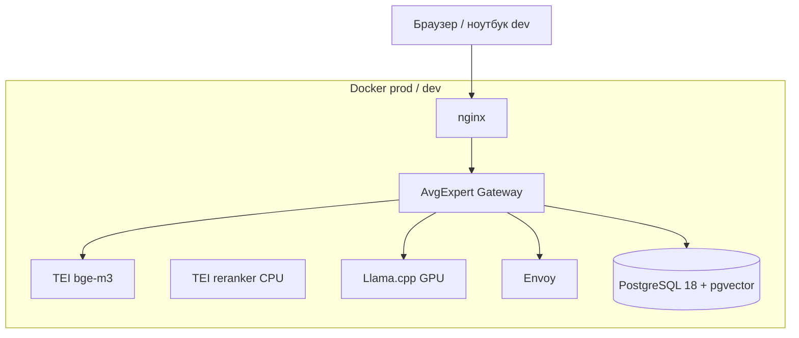
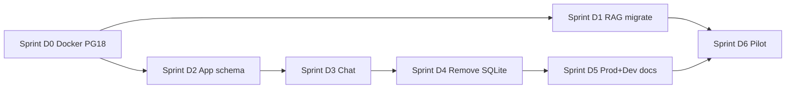

# План: единая платформа PostgreSQL 18 + Docker (prod + dev)

**Статус:** согласовано (2026-06-11, уточнение ADR 2026-06-11)  
**Версия:** 1.2  
**Без сроков** — только этапы, спринты и задачи.  
**Схема работы:** один спринт D{N} = отдельный чат; пользователь пишет **«продолжай»** — план в чат не копируется.  
**Точка входа:** [`SPRINT_STATE.md`](../sprints/SPRINT_STATE.md) + `.cursor/rules/pg18-sprint-handoff.mdc`.

---

## 1. Цель и границы

### Цель

Перевести AvgExpert на **единый PostgreSQL 18 + pgvector** в Docker (prod и dev), перенести RAG-корпус с удалённого PG 18, **отказаться от SQLite** (в запросе указан MySQL — в проекте **MySQL не используется**, см. §2), сохранить функциональность Gateway и RAG v2.

### В scope

| # | Решение |
|---|---------|
| 1 | PG **18** в Docker (prod + dev) |
| 2 | Перенос `kb_*` с удалённого PG 18 → локальный PG 18 в compose |
| 3 | Прикладные данные (users, sessions, chat, categories…) — **новая схема в PG**, без миграции из SQLite |
| 4 | Docker: профили **prod** и **dev** |
| 5 | Отказ от `better-sqlite3` и legacy SQLite FTS fallback |
| 6 | Подготовка выката на pilot-сервер (L4) |

### Out of scope

- Миграция исторических чатов / пользователей из SQLite
- Поддержка MySQL (не применимо)
- Семантический граф как production gate (остаётся opt-in)
- Замена PostgreSQL на Qdrant / Weaviate

### Критерий успеха (DoD программы)

- [ ] Один `DATABASE_URL` → PG 18 для app + RAG
- [ ] `npm run test:ci` на PG (без SQLite)
- [ ] `kb_chunks` на локальном PG: count и `vector_dims` совпадают с источником
- [ ] Pilot: WEB + RAG consultant/expert в интернете
- [ ] Dev на ноутбуке: `docker compose` dev-профиль + hot reload
- [ ] `FTS_FALLBACK_ENABLED=false`, качество RAG в штатном режиме не ниже текущего

---

## 2. Уточнение: MySQL vs SQLite

| СУБД | В проекте сейчас | Действие |
|------|------------------|----------|
| **MySQL** | не используется | — |
| **SQLite** | users, chat, categories, legacy FTS | **заменить на PG 18** |
| **PostgreSQL** | RAG `kb_*` | **единственная БД** |

---

## 3. Целевая архитектура

**Слои данных в PG 18:**

| Схема / таблицы | Назначение |
|-----------------|------------|
| `kb_documents`, `kb_chunks`, `kb_semantic_*` | RAG (перенос с удалённого PG) |
| `users`, `sessions`, `messages`, `categories`, … | App (создать заново) |
| `vector_migrations` + `app_migrations` | Миграции |

---

## 4. Решения (утверждено 2026-06-11)

| ID | Решение | Статус |
|----|---------|--------|
| **ADR-1** | **`pgvector/pgvector:pg18`** (community), локаль **`ru_RU.UTF-8`**, encoding UTF8 | ✅ |
| **ADR-2** | FTS fallback → **PG `tsvector`** на `kb_chunks` (конфиг `russian`), не SQLite FTS5 | ✅ |
| **ADR-3** | App SQLite не мигрировать; RAG — dump с удалённого PG 18 | ✅ |
| **ADR-4** | Dev: **app на ноутбуке**, сервисы (PG, TEI, Llama, Envoy) в **Docker на удалённом** pilot; подготовка к опытному prod | ✅ |
| **ADR-5** | Один спринт D{N} = отдельный чат; handoff: `.cursor/rules/pg18-sprint-handoff.mdc` | ✅ |

### Русский язык в PostgreSQL 18

| Уровень | Требование |
|---------|------------|
| Локаль кластера | `lc_collate` / `lc_ctype` = `ru_RU.UTF-8` |
| Клиент / app | `LANG=ru_RU.UTF-8` в контейнерах |
| Текст в RAG | `kb_chunks.body` — UTF-8; bge-m3 многоязычный (RU поддерживается) |
| FTS fallback (ADR-2) | `to_tsvector('russian', body)` + GIN-индекс; тот же корпус `kb_chunks`, что и pgvector |

### Dev-модель (ADR-4)

| Компонент | Ноутбук | Удалённый pilot (Docker) |
|-----------|---------|--------------------------|
| Gateway `npm start` | ✅ | позже контейнер `app` |
| PG 18 + pgvector | туннель `5433→5432` | ✅ compose |
| TEI / Llama / Envoy | туннель | ✅ compose |
| Документация | [`deploy/dev/DEV_REMOTE.md`](../../deploy/dev/DEV_REMOTE.md) | [`deploy/prod/README.md`](../../deploy/prod/README.md) |

---

## 5. Этапы программы

| Этап | Название | Результат |
|------|----------|-----------|
| **E0** | Согласование и ADR | Утверждён этот план, зафиксированы ADR-1…4 |
| **E1** | Docker PG 18 + compose prod + dev-remote | Prod compose на pilot; ноутбук → remote services |
| **E2** | Перенос RAG | `kb_*` на локальном PG 18 |
| **E3** | App на PostgreSQL | Репозитории без SQLite, новый seed |
| **E4** | Отказ от legacy | Удалён `better-sqlite3`, SQLite FTS → PG tsvector, тесты на PG |
| **E5** | Pilot + dev workflow | Документация, ssh-deploy, чеклисты |
| **E6** | Приёмка опытной эксплуатации | Sign-off, архив SQLite |

---

## 6. Спринты и задачи

### Sprint D0 — Docker foundation (E0 + E1)

| ID | Задача | Критерий приёмки |
|----|--------|------------------|
| D0-1 | Зафиксировать ADR-1…4 в §4 | Отметки согласования в этом файле |
| D0-2 | Обновить `deploy/prod/compose.yml`: PG **18**, pgvector | `pg_isready`, extension `vector` ≥ 0.5 |
| D0-3 | PG init: `ru_RU.UTF-8`, UTF8 (`POSTGRES_INITDB_ARGS` / init script) | `SHOW lc_collate;` |
| D0-4 | [`deploy/dev/DEV_REMOTE.md`](../../deploy/dev/DEV_REMOTE.md) + `env.laptop-remote.example` | Ноутбук → remote PG/TEI |
| D0-5 | `deploy/prod/env.example` — PG 18, ru_RU | Документировано |
| D0-6 | npm scripts `prod:up`; ссылка на DEV_REMOTE в README | Шпаргалка |
| D0-7 | `kb:pg:smoke` на PG 18 (на pilot или через туннель) | PASS |

---

### Sprint D1 — Перенос RAG (E2)

| ID | Задача | Критерий приёмки |
|----|--------|------------------|
| D1-1 | Обновить `migrate-rag-db.sh` под PG 18 local | dry-run + полный перенос |
| D1-2 | Перенос с удалённого PG 18 → локальный PG 18 | `COUNT(kb_chunks)` источник = цель |
| D1-3 | Проверка: `vector_dims(embedding)=1024`, namespace | SQL + `kb:pg:smoke` |
| D1-4 | `embedding:smoke` + тестовый RAG-чат | Контекст из перенесённого корпуса |
| D1-5 | Бэкап-скрипт PG (`pg_dump -Fc`) | Документирован one-liner |
| D1-6 | Отключить зависимость app от удалённого PG в `.env` | Только локальный `DATABASE_URL` |

---

### Sprint D2 — Схема app в PG + ядро (E3)

| ID | Задача | Критерий приёмки |
|----|--------|------------------|
| D2-1 | Модуль `src/core/pg/` — pool, миграции app | Аналог `sqlite.ts` для PG |
| D2-2 | SQL-миграции: users, categories (из v001…v030 логики) | Чистая установка на пустой PG |
| D2-3 | Seed: admin, категории (Консультант/Эксперт/Мудрец) | Логин admin по `.env` |
| D2-4 | `user.repository` → PG | `test:security` PASS |
| D2-5 | `category.repository` + admin categories → PG | CRUD в админке |
| D2-6 | Абстракция `DatabasePort` (опционально) | Единая точка для тестов |

---

### Sprint D3 — Chat, sessions, KB routes (E3)

| ID | Задача | Критерий приёмки |
|----|--------|------------------|
| D3-1 | `session.repository`, messages → PG | История чата сохраняется |
| D3-2 | `chat.service` без SQLite | SSE/stream работает |
| D3-3 | Payments / audit / mission repos → PG (если включены) | Соответствующие тесты PASS |
| D3-4 | `llm_response_cache` → PG | Кэш LLM работает |
| D3-5 | Интеграционные тесты на PG (`test:integration`) | CI-матрица обновлена |

---

### Sprint D4 — PG tsvector fallback + удаление SQLite (E4)

| ID | Задача | Критерий приёмки |
|----|--------|------------------|
| D4-1 | Миграция PG: `tsvector` колонка / GIN на `kb_chunks.body`, config **`russian`** | Индекс создан, кириллица в smoke-query |
| D4-2 | `pg_tsvector.retriever.ts` — fallback по `kb_chunks` (global scope) | Тест unit/integration |
| D4-3 | `DegradedRetriever`: PG tsvector вместо `sqlite_fts.adapter` | `retrieverId=pg-tsvector-fallback` |
| D4-4 | Удалить `sqlite_fts.adapter`, legacy `knowledge_chunks_fts` | Нет SQLite FTS в RAG path |
| D4-5 | Удалить `better-sqlite3`, `src/core/sqlite.ts`, миграции v001…v030 | App на PG из D2–D3 |
| D4-6 | Тесты на PG; `npm run test:ci` PASS | CI без SQLite |
| D4-7 | Удалить `ensure-better-sqlite3.js`; упростить `Dockerfile.app` | Нет native sqlite |

---

### Sprint D5 — Pilot workflow + документация (E5)

| ID | Задача | Критерий приёмки |
|----|--------|------------------|
| D5-1 | **Prod compose** на L4: PG 18, VRAM 8GB, nginx | `install.sh` one-shot |
| D5-2 | App в Docker на pilot + выкат `prod:ssh-update` | WEB HTTPS |
| D5-3 | `DEV_REMOTE.md` + туннели / firewall checklist | Ноутбук → pilot smoke |
| D5-4 | `DEV_TO_PILOT.md`, `SSH_DEPLOY.md`, `RAG_DB_MIGRATION.md` | Единый сценарий |
| D5-5 | `ssh-deploy.sh`: prepare → install → update | С ноутбука |
| D5-6 | Скрипт `deploy/dev/tunnel.cmd` / `tunnel.sh` (опционально) | PG+TEI+Llama туннели |

---

### Sprint D6 — Приёмка pilot (E6)

| ID | Задача | Критерий приёмки |
|----|--------|------------------|
| D6-1 | Развёртывание на L4 vGPU-8-16-L4-8Q | WEB по HTTPS |
| D6-2 | Перенос RAG (D1) на prod-сервере | Smoke RAG |
| D6-3 | Новый admin + тестовые пользователи | Авторизация, роли |
| D6-4 | `GET /health` + admin dashboard RAG metrics | vector ok, latency p95 |
| D6-5 | Отказоустойчивость: рестарт `app` / `postgres` | Данные в volume сохранены |
| D6-6 | Sign-off опытной эксплуатации | Чеклист §7 подписан |

---

## 7. Чеклист приёмки программы

### Инфраструктура

- [ ] PostgreSQL **18** + pgvector в Docker prod
- [ ] Dev-remote: ноутбук + сервисы на pilot Docker
- [ ] `DATABASE_URL` один для app и RAG

### Данные

- [ ] RAG перенесён с удалённого PG 18
- [ ] App-данные созданы заново (seed)
- [ ] SQLite файлы не используются

### Качество RAG

- [ ] Штатный путь: pgvector + bge-m3 (+ rerank при включении)
- [ ] FTS fallback: PG `tsvector` (`russian`) на `kb_chunks`, без SQLite FTS
- [ ] Сравнительный smoke: consultant + expert до/после (субъективно / eval)

### Код и тесты

- [ ] Нет `better-sqlite3` в зависимостях
- [ ] `test:ci` PASS
- [ ] `test:rag`, `test:vector` PASS на PG

### Эксплуатация

- [ ] Бэкап / restore PG проверен
- [ ] Выкат с ноутбука: `prod:ssh-update`
- [ ] Документация актуальна

**Sign-off:** _______________  **Дата:** _______________

---

## 8. Риски и митигация

| Риск | Митигация |
|------|-----------|
| Образ `pgvector:pg18` недоступен | PG 17 + pgvector или Postgres Pro 18 от вендора (ADR-1) |
| OOM на L4 8GB VRAM | Пресет `8gb-vram.env`, reranker на CPU |
| Потеря RAG при переносе | dry-run, сверка COUNT, бэкап до migrate |
| Регрессия без SQLite FTS | PG tsvector на том же `kb_chunks` — не хуже legacy для RU keyword fallback |
| Большой объём репозиториев D2–D3 | Порядок: auth → categories → sessions → chat |
| Ноутбук без туннеля к pilot | `DEV_REMOTE.md`, SSH config, mock для unit-тестов |

---

## 9. Backlog (после программы)

| ID | Задача |
|----|--------|
| BL-1 | ~~PG tsvector~~ → **D4** (ADR-2) |
| BL-2 | Postgres Pro-специфичные фичи (если лицензия) |
| BL-3 | App read-replica / connection pool tuning |
| BL-4 | Полный отказ от `KnowledgeGateway` legacy |

---

## 10. Зависимости между спринтами

**Параллельно возможно:** D1 (RAG migrate) и D2 (app schema) после D0.

---

## 11. Связанные документы

- [`deploy/prod/README.md`](../../deploy/prod/README.md)
- [`deploy/prod/RAG_DB_MIGRATION.md`](../../deploy/prod/RAG_DB_MIGRATION.md)
- [`deploy/prod/DEV_TO_PILOT.md`](../../deploy/prod/DEV_TO_PILOT.md)
- [`architecture/RAG_MIGRATION_PLAN.md`](../architecture/RAG_MIGRATION_PLAN.md)
- [`ops/RAG_OPS_RUNBOOK.md`](../ops/RAG_OPS_RUNBOOK.md)

---

## 12. Лист согласования

| Роль | Решение | Дата |
|------|---------|------|
| Владелец продукта | ✅ community pgvector:pg18, ru_RU.UTF-8, спринты в отдельных чатах | 2026-06-11 |

**Замечания:** —

## 13. Карта чатов (агентская схема)

| Чат | Спринт | Старт пользователя |
|-----|--------|-------------------|
| 1 | **D0** | новый чат → **продолжай** |
| 2 | D1 | новый чат → **продолжай** |
| … | D2…D6 | то же |

Агент при старте читает [`SPRINT_STATE.md`](../sprints/SPRINT_STATE.md) (задачи + ADR).  
Отдельные `SPRINT_D*.md` **не ведутся** — при закрытии спринта агент обновляет таблицу в STATE.
